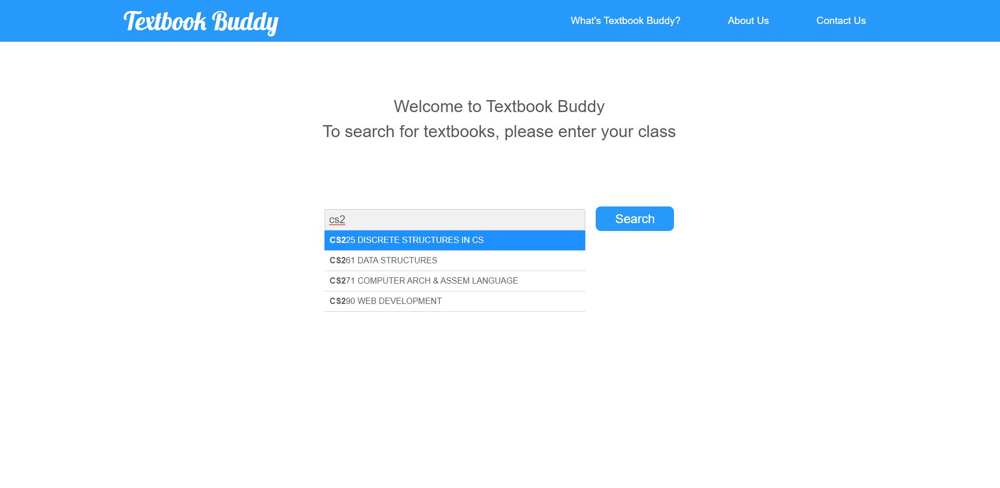
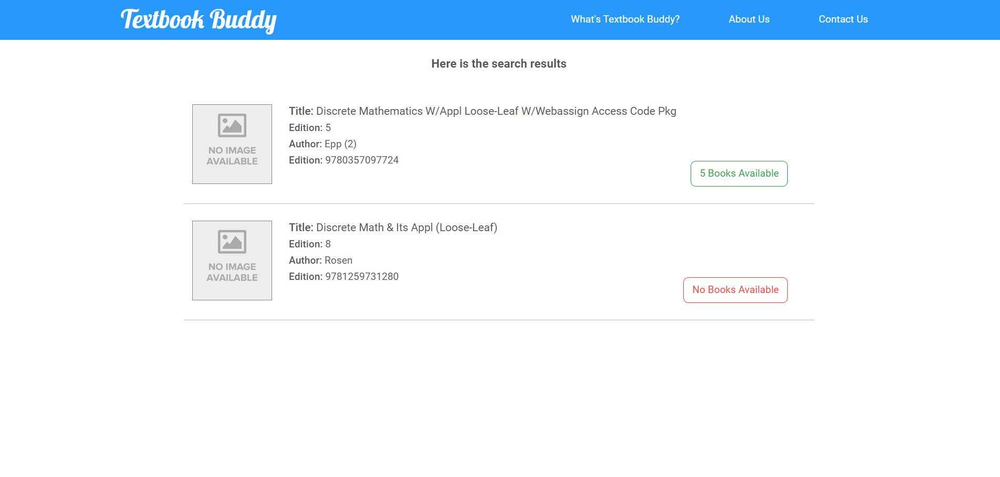
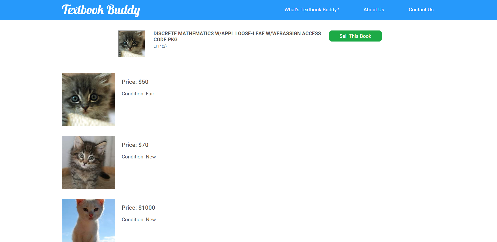
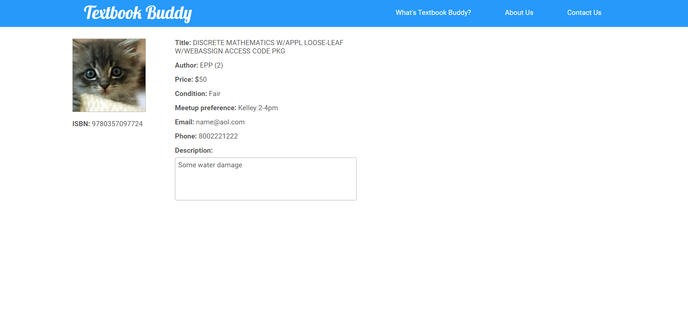
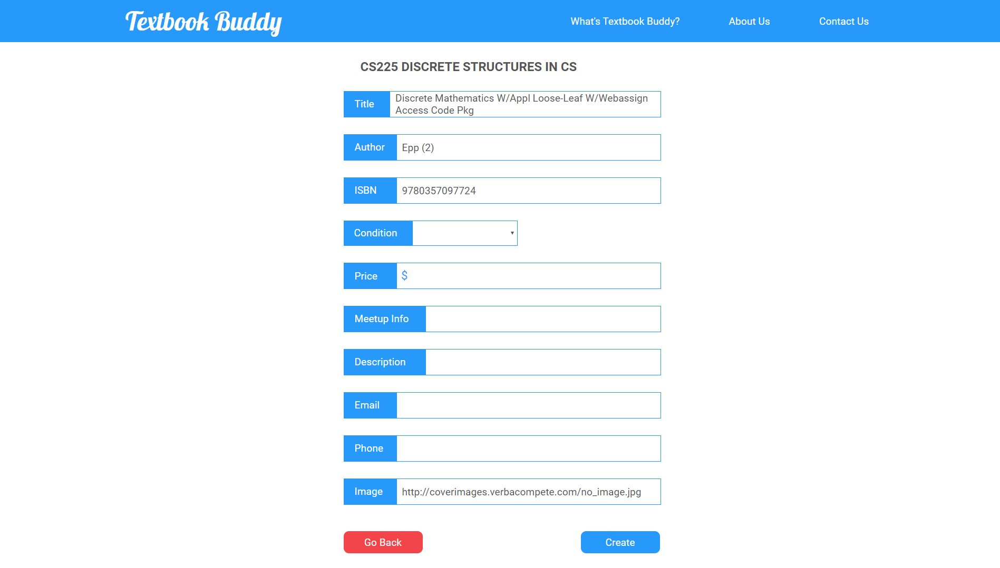

# Textbook Buddy
This website is a marketplace where students can buy and sell their used textbooks, cutting out the expensive middlemen.

This is the final project for our Web Dev class at Oregon State University.

## Installation
1. Clone the repository to your local directory
   ``` 
   git clone https://github.com/osu-cs290-f19/textbook-buddy.git
   ```
2. Download and install Nodejs from https://nodejs.org/en/ If you already installed NodeJs, then you can skip this step.
3. Run `npm install` to install all dependencies
4. Run `npm start` to start the server
5. On your browser, go to `localhost:3000` to visit the website

## Features and Description
- From home page, users can search for the class that they've used the textbook in (for sellers); or the class that they need the textbook for (for buyers)
  - Ex: CS225 or ENG107, etc. Autocompletion is limited to CS courses because we didn't have access to the whole database of all classes and disciplines at OSU.


 

- The searched class will result in the textbooks that are used in such class. Users can choose the textbook that they want to buy/sell
  - This is done by fetching textbook data from OSU API




- By choosing a textbook, buyers can see the all the posts selling that book or sellers can choose to sell that one.



- A detailed post of a textbook.



- Or sellers can create a new post for that textbook


   

## Upcoming Features
- Implement MongoDB as the main database and Redis as a temporary database for faster data transfer between pages
- Implement log in and authentication

## People
Idea, design and overall contribution by me (Quan Nguyen), with the help from my team mates: Arthur, Erick and Zexian.


